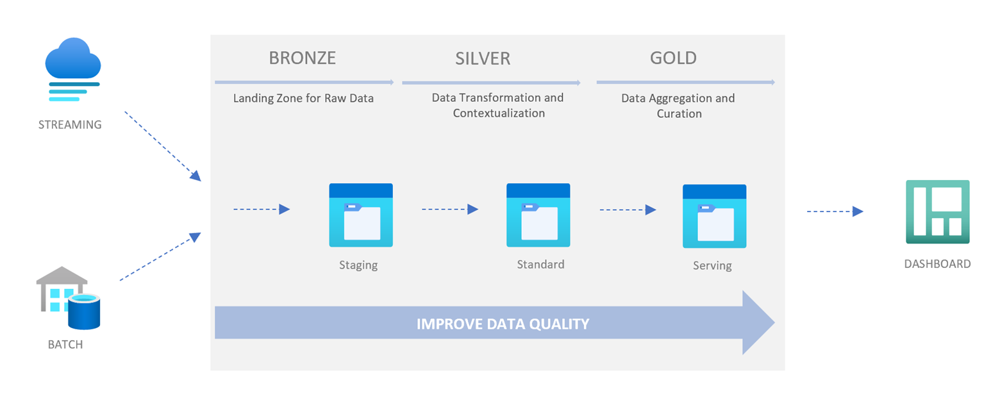
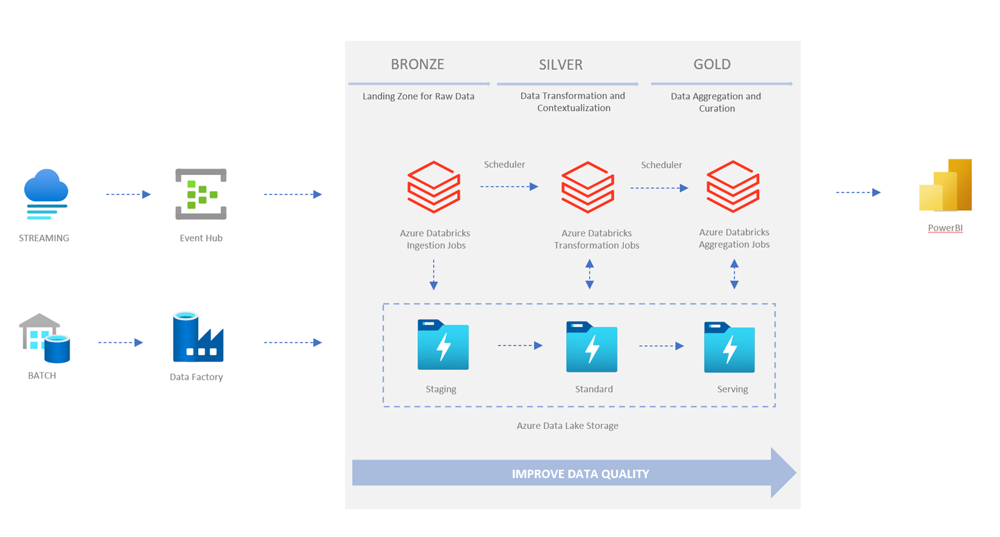
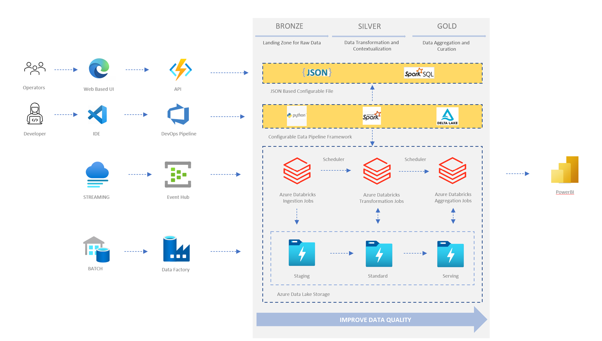
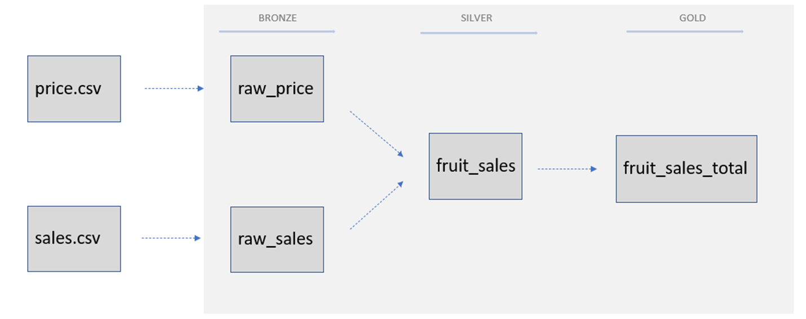

# Config-Driven Data Pipeline

[](https://pypi.org/project/cddp)

## Why this solution

This repository is to illustrate the basic concept and implementation of the solution of config-driven data pipeline. The configuration is a JSON file that contains the information about the data sources, the data transformations and the data curation. The configuration file is the only file that needs to be modified to change the data pipeline. **In this way, even business users or operation team can modify the data pipeline without the need of a developer.**

This repository shows a simplified version of this solution based on [Azure Databricks](https://learn.microsoft.com/en-us/azure/databricks/introduction/), [Apache Spark](https://spark.apache.org/docs/latest/index.html) and [Delta Lake](https://www.delta.io). The configuration file is converted into Azure Databricks Job as the runtime of the data pipeline. It targets to provide a lo/no code data app solution for business or operation team.

## Background



This is the medallion architecture introduced by Databricks. And it shows a data pipeline which includes three stages: Bronze, Silver, and Gold. In most data platform projects, the stages can be named as Staging, Standard and Serving.

- Bronze/Staging: The data from external systems is ingested and stored in the staging stage. The data structures in this stage correspond to the source system table structures "as-is," along with any additional metadata columns that capture the load date/time, process ID, etc.
- Silver/Standardization: The data from the staging stage is cleansed and transformed and then stored in the standard stage. It provides enriched datasets for further business analysis. The master data could be versioned with slowly changed dimension (SCD) pattern and the transaction data is deduplicated and contextualized with master data.
- Gold/Serving: The data from the standard stage is aggregated and then stored in the serving stage. The data is organized in consumption-ready "project-specific" databases, such as Azure SQL.



The above shows a typical way to implement a data pipeline and data platform based on Azure Databricks.

- Azure Data Factory can be used to load external data and store to Azure Data Lake Storage.
- Azure Data Lake Storage (ADLS) can be applied as the storage layer of the staging, standard, and serving stage.
- Azure Databricks is the calculation engine for data transformation, and most of the transformation logic can be implemented with pySpark or SparkSQL.
- Azure Synapse Analytics or Azure Data Explorer is the solution of serving stage.
The medallion architecture and Azure big data services consist of the infrastructure of an enterprise data platform. Then data engineers can build transformation and aggregation logic with programming languages such as Scala, Python, SQL etc. Meanwhile, DevOps is mandatory in the modern data warehouse.

## Architecture



Inspired by Data Mesh, we try to create a solution to accelerate the data pipeline implementation and reduce the respond time to changing business needs, where we’d like to help business team can have the ownership of data application instead of data engineers, who could focus on the infrastructure and frameworks to support business logic more efficiently.

The configurable data pipeline includes two parts

- Framework: The framework is to load the configuration files and convert them into Spark Jobs which could be run with Databricks. It encapsulates the complex Spark cluster and job runtime and provides a simplified interface to users, who can focus on business logic. The framework is based on pySpark and Delta Lake and managed by developers.
- Configuration: It is the metadata of the pipeline, which defines the pipeline stages, data source information, transformation and aggregation logic which can be implemented in SparkSQL. And the configuration can be managed by a set of APIs. The technical operation team can manage the pipeline configuration via a Web UI based on the API layer.

## Example

Here is an example to show how to use the framework and configuration to build a data pipeline. 

We need to build a data pipeline to calculate the total revenue of fruits.



There are 2 data sources:

- [fruit price](example/data/fruit-price/001.csv) – the prices could be changed frequently and saved as CSV files which upload into the landing zone.
- [fruit sales](example/data/fruit-sales/2022-01-10.csv) – it is streaming data when a transition occurs, an event will be omitted. And the data is saved as CSV file into a folder of landing zone as well.
In the standardized zone, the price and sales view can be joined. Then in the serving zone, the fruit sales data can be aggregated.

The [configuration file](example/pipeline_fruit_batch.json) describes the pipeline.

In the pipeline, it includes the 3 blocks:

- **staging**
- **standard**
- **serving**

The staging block defines the data sources. The standardization block defines the transformation logic. The serving block defines the aggregation logic.
Spark SQL are used in the standardization block and the serving block, one is merge price and sales data and the other is for aggregation of the sales data.

Run the batch mode pipeline in local PySpark environment:

```bash
python src/main.py --config-path ./example/pipeline_fruit_batch.json --working-dir ./tmp --show-result True --build-landing-zone True --cleanup-database True
```

Here is [another example](example/pipeline_fruit_streaming.json) of streaming based data pipeline. 

Run the streaming mode pipeline in local PySpark environment:

```bash
python src/main.py --config-path ./example/pipeline_fruit_streaming.json --working-dir ./tmp --await-termination 60 --show-result True  --build-landing-zone True --cleanup-database True
```

After running the pipeline, the result will show in the console.

  id|      fruit|total
----|-----------|------
   4|Green Apple| 45.0
   7|Green Grape| 36.0
   5| Fiji Apple| 56.0
   1|  Red Grape| 24.0
   3|     Orange| 28.0
   6|     Banana| 17.0
   2|      Peach| 39.0
  
## Reference

- [Medallion Architecture – Databricks](https://www.databricks.com/glossary/medallion-architecture)

- [How to Use Databricks to Scale Modern Industrial IoT Analytics - Part 1 - The Databricks Blog](https://www.databricks.com/blog/2020/08/03/modern-industrial-iot-analytics-on-azure-part-1.html)

- [How to Implement CI/CD on Databricks Using Databricks Notebooks and Azure DevOps - The Databricks Blog](https://www.databricks.com/blog/2021/09/20/part-1-implementing-ci-cd-on-databricks-using-databricks-notebooks-and-azure-devops.html)

- [Break Through the Centralized Platform Bottlenecks with Data Mesh | Thoughtworks](https://www.thoughtworks.com/en-sg/insights/articles/break-though-the-centralized-platform-bottlenecks-with-data-mesh)

## Contributing

This project welcomes contributions and suggestions.  Most contributions require you to agree to a
Contributor License Agreement (CLA) declaring that you have the right to, and actually do, grant us
the rights to use your contribution. For details, visit https://cla.opensource.microsoft.com.

When you submit a pull request, a CLA bot will automatically determine whether you need to provide
a CLA and decorate the PR appropriately (e.g., status check, comment). Simply follow the instructions
provided by the bot. You will only need to do this once across all repos using our CLA.

This project has adopted the [Microsoft Open Source Code of Conduct](https://opensource.microsoft.com/codeofconduct/).
For more information see the [Code of Conduct FAQ](https://opensource.microsoft.com/codeofconduct/faq/) or
contact [opencode@microsoft.com](mailto:opencode@microsoft.com) with any additional questions or comments.

## Legal Notices

Microsoft and any contributors grant you a license to the Microsoft documentation and other content
in this repository under the [Creative Commons Attribution 4.0 International Public License](https://creativecommons.org/licenses/by/4.0/legalcode),
see the [LICENSE](LICENSE) file, and grant you a license to any code in the repository under the [MIT License](https://opensource.org/licenses/MIT), see the
[LICENSE-CODE](LICENSE-CODE) file.

Microsoft, Windows, Microsoft Azure and/or other Microsoft products and services referenced in the documentation
may be either trademarks or registered trademarks of Microsoft in the United States and/or other countries.
The licenses for this project do not grant you rights to use any Microsoft names, logos, or trademarks.
Microsoft's general trademark guidelines can be found at http://go.microsoft.com/fwlink/?LinkID=254653.

Privacy information can be found at <https://privacy.microsoft.com/en-us/>

Microsoft and any contributors reserve all other rights, whether under their respective copyrights, patents,
or trademarks, whether by implication, estoppel or otherwise.
