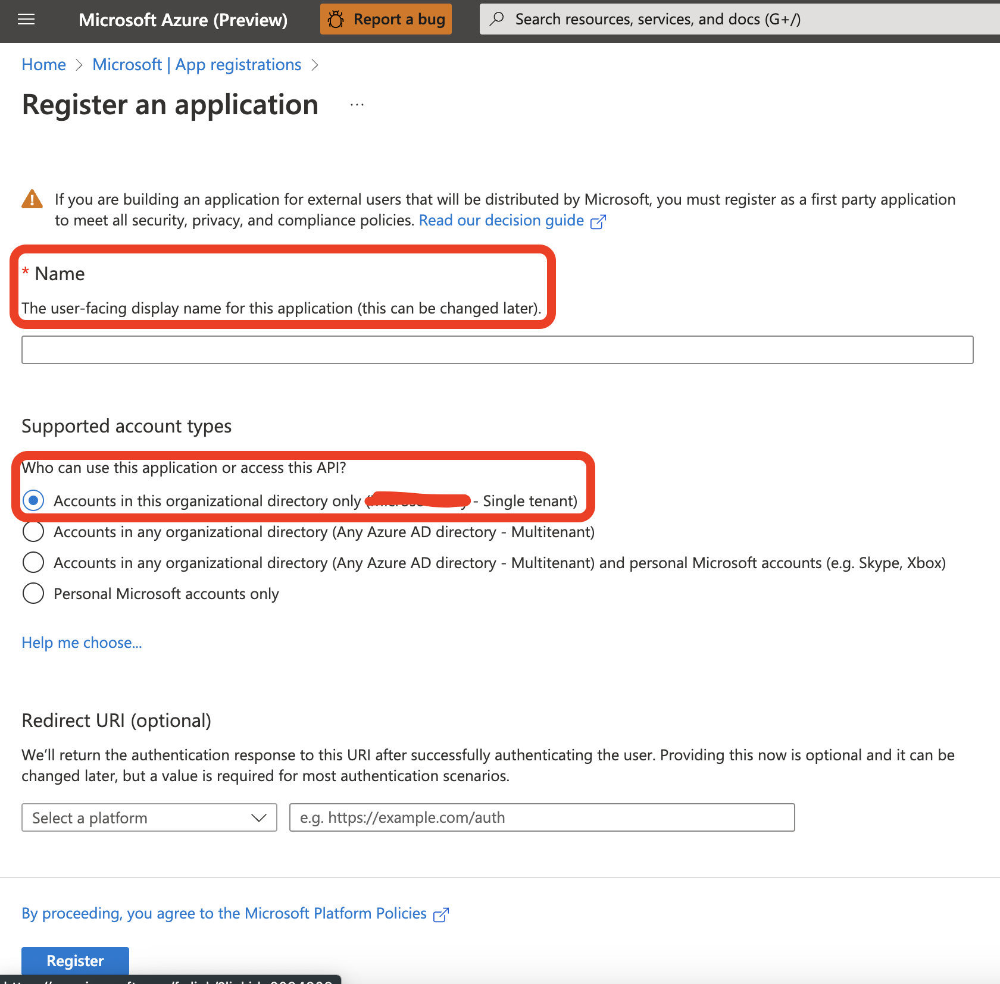
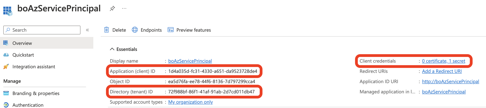
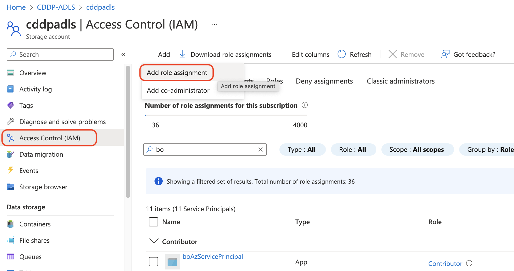
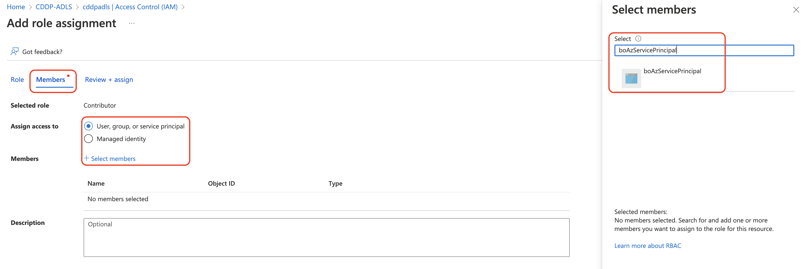
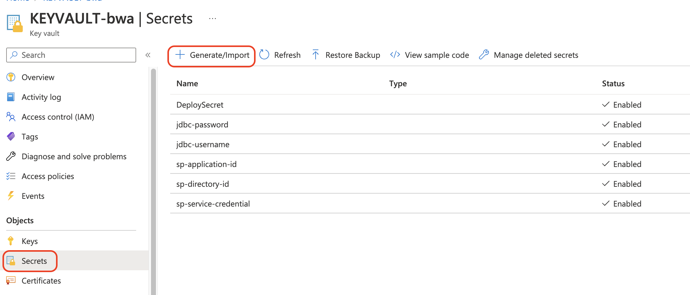

# ADLS/JDBC Data Ingestion

## If you want to setup ADLS or JDBC AS pipline data source you need setup the service principal, Azure key vault and databricks secret scope

### Create Azure Lake Storage Account

- The Data Lake Storage account that will use the service principal must be Gen2. Azure Data Lake Gen1 storage accounts are not supported.
- The Data Lake Storage account has hierarchical namespace enabled.
- Admin permissions for your Azure tenant, if you have to create a new service principal.

### Create an Azure service principal for Customer Insights

#### Look for an existing service principal

1. Go to the Azure admin portal and sign in to your organization.
2. From Azure services, select Azure Active Directory.
3. Under Manage, select App registrations.
4. If you find a matching record, it means that the service principal already exists. Grant permissions for the service principal to access the storage account.

#### Create a new service principal

1. Go to the Azure admin portal and sign in to your organization.
2. From Azure services, select Azure Active Directory.
3. Under Manage, select App registrations.
4. New Registration

5. recorded information
    - Application (client) ID
    - Directory (tenant) ID
    - Client credentials

#### Grant permissions to the service principal to access the storage account

1. Go to the ADLS in Azure admin portal.
2. Select Access Cintrol (IAM)
3. Add role assignment

4. Select the label Role => Contributor => Next

5. Under label Members => User, group, service pricipal
6. Search and select service principal name just created
7. Click Review + assign

#### ADD ADLS and JDBC info into Azure Key Vault

- Secrets => Generate/Import
- add service principal and JDBC user name and password

