# How To Create New Parking_Sensor Pipeline
## 1. Create .env file to save information about Databricks settings
Get information about DATABRICKS_HOST, DATABRICKS_TOKEN, and DATABRICKS_CLUSTER, and create .env file to store them in order to specify the Databricks instance.
```sh
DATABRICKS_HOST=
DATABRICKS_TOKEN=
DATABRICKS_CLUSTER=
```
## 2. Run python web app using Flask
Run and Debug using Python: Flask.
## 3. Open the website
Open the website and click **New**.
## 4. Pipeline settings
Go to **Pipeline Settings**, click **General** to define Pipeline name.
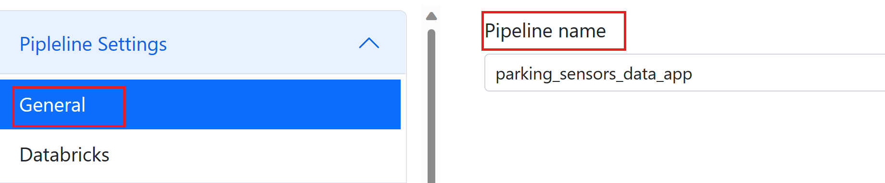
Click **Databricks** to customize Databricks job name and working directory.
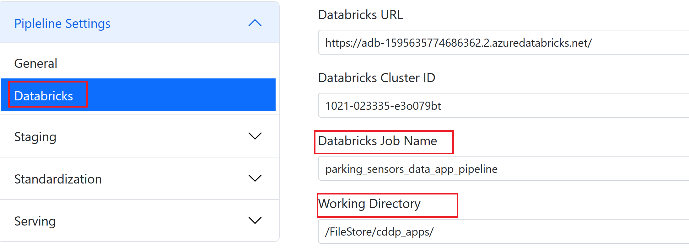
## 5. Staging stage
Go to **Staging** section, and click **Add Task** to create tasks, so that data from external systems can be ingested and stored in the staging stage. 

We create four ingestion jobs, where we need to define task name, data source type, file format, file path, data source mode, output target, and output format.

After importing sample data, you can have a look at data source schema and sample data.

1# parking_bay_ingestion, ingesting data about [parking bays](/example/data/parking-sensors/layer_0.csv) and save the output target as stg_parking_bay_data.
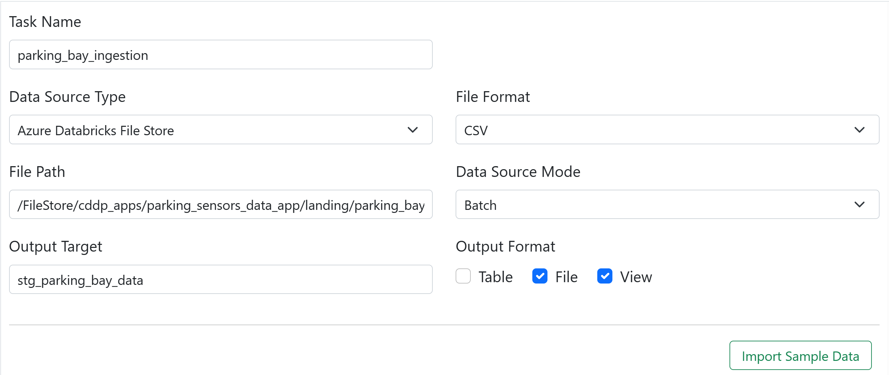 
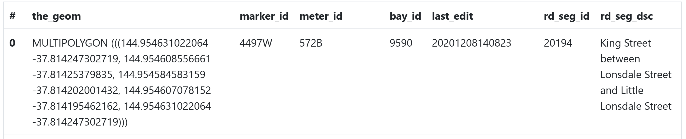
2# parking_sensors_ingestion, ingesting data collected from [parking sensors](/example/data/parking-sensors/On-street_Parking_Bay_Sensors.csv) and save the output target as stg_parking_bay_data.
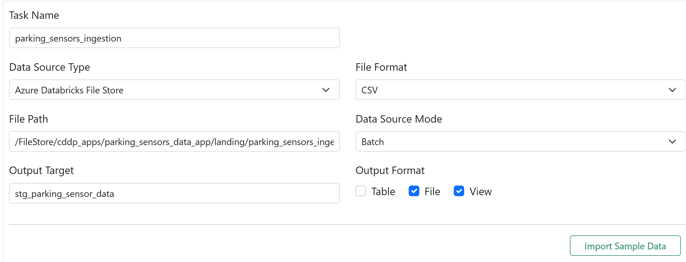 
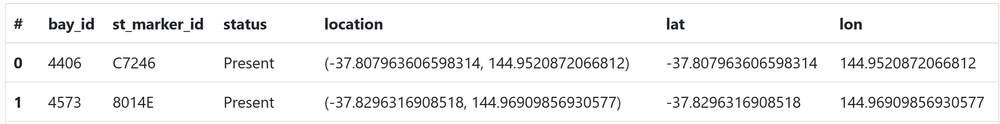
3# date_ingestion, ingesting data about [date](/example/data/parking-sensors/seed/dim_date.csv) and save the output target as stg_dim_date.
 
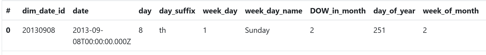
4# time_ingestion, ingesting data about [time](/example/data/parking-sensors/seed/dim_time.csv) and save the output target as stg_dim_time.
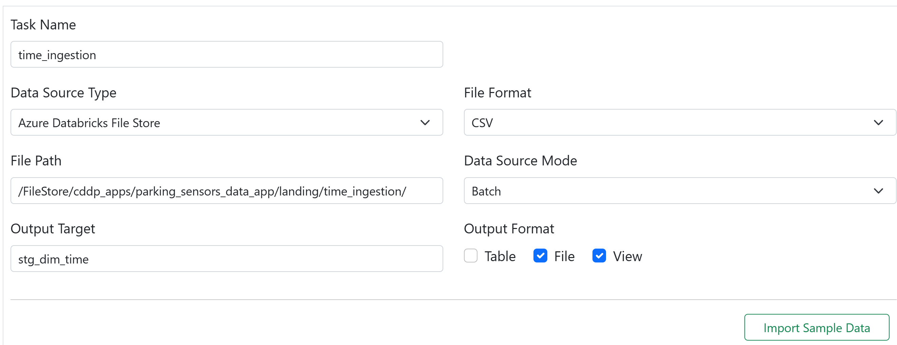 
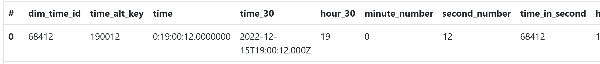

## 6. Standardization stage
Go to **Standardization** section, and click **Add Task** to create tasks, so that data from the staging stage can be cleansed and transformed either using SQL or Python either SQL or Python and then stored in the standard stage.

We create two tasks in the standardization stage.

One is parking_bay_standardize, where we use SQL query below to select columns from stg_parking_bay_data, which is the output target in the previous parking_bay_ingestion task, convert data type for last_edit column, add new column for current timestamp, and save the output to interim_parking_bay.
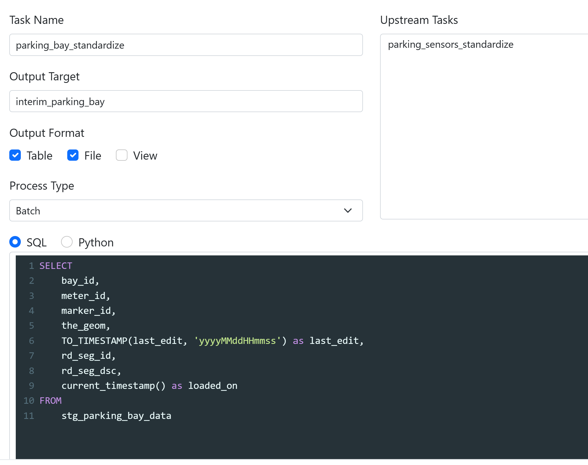

Another task is parking_sensors_standardize, where we use SQL query below to select columns from stg_parking_sensor_data, which is the output target in the previous parking_sensor_ingestion task, convert data type for lat/lon column, add new column for current timestamp, and save the output to interim_sensor.
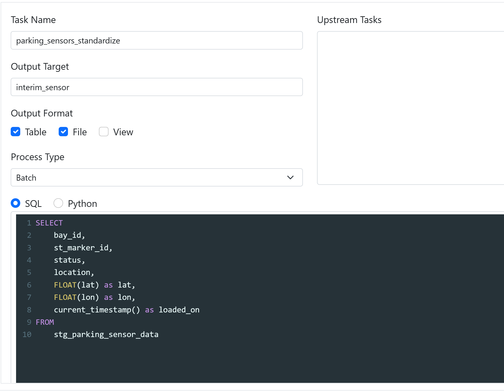

## 7. Serving stage
Go to **Serving** section, and click **Add Task** to create tasks, so that data from the standard stage can be aggregated using either SQL or Python and then stored in the serving stage.

We create six tasks in the serving stage.

1# fact_parking_curation, where we can use SQL query below to select columns from interim_sensor, which is the output target in the previous parking_sensors_standardize task, convert data type for loaded_on column, add new column for time id, and save the output to dw_fact_parking.
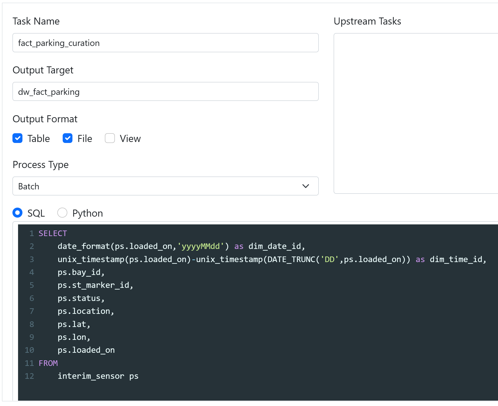

2# parking_bay_curation, where we can use SQL query below to select columns from interim_parking_bay, which is the output target in the previous parking_bay_standardize task, add new column for parking bay id using UUID, and save the output to dw_dim_parking_bay.
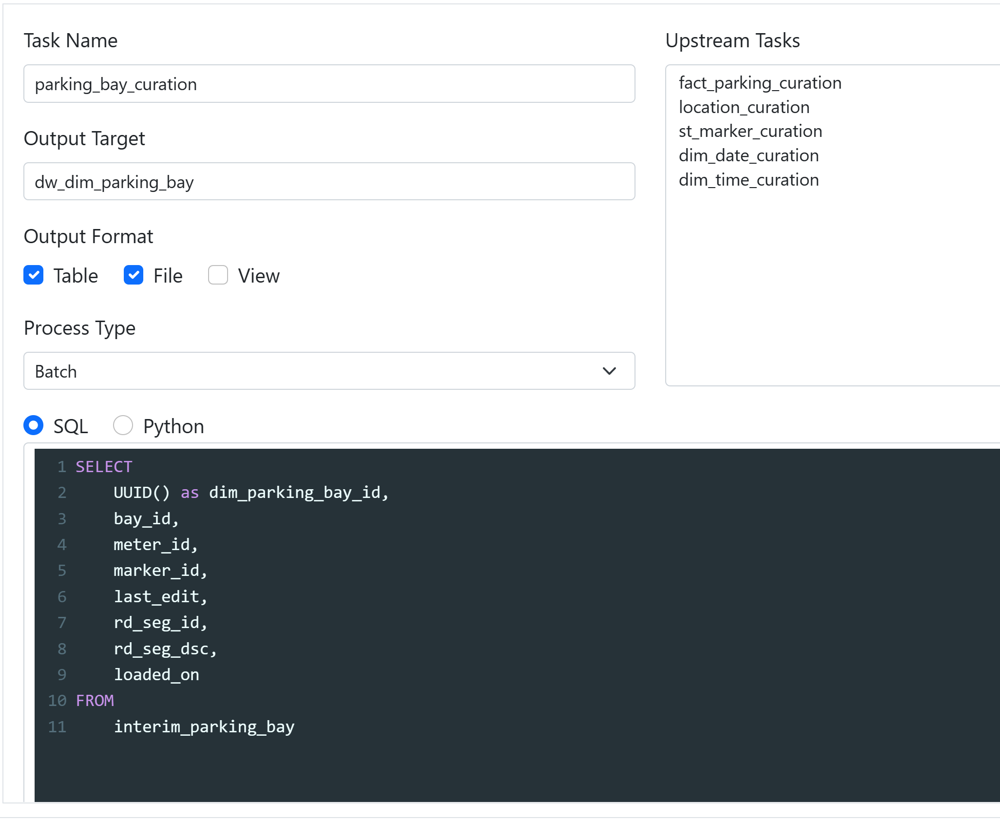

3# location_curation, where we can use SQL query below to select columns from interim_sensor, which is the output target in the previous parking_sensor_standardize task, add new column for location id using UUID, and save the output to dw_dim_location.
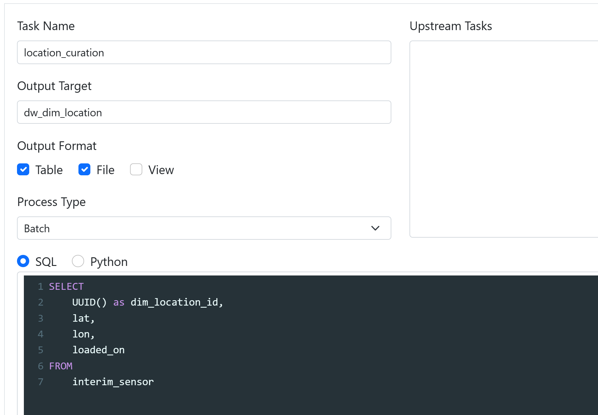

4# st_marker_curation, where we can use SQL query below to select columns from interim_sensor, which is the output target in the previous parking_sensor_standardize task, add new column for st marker id using UUID, and save the output to dw_dim_st_marker.
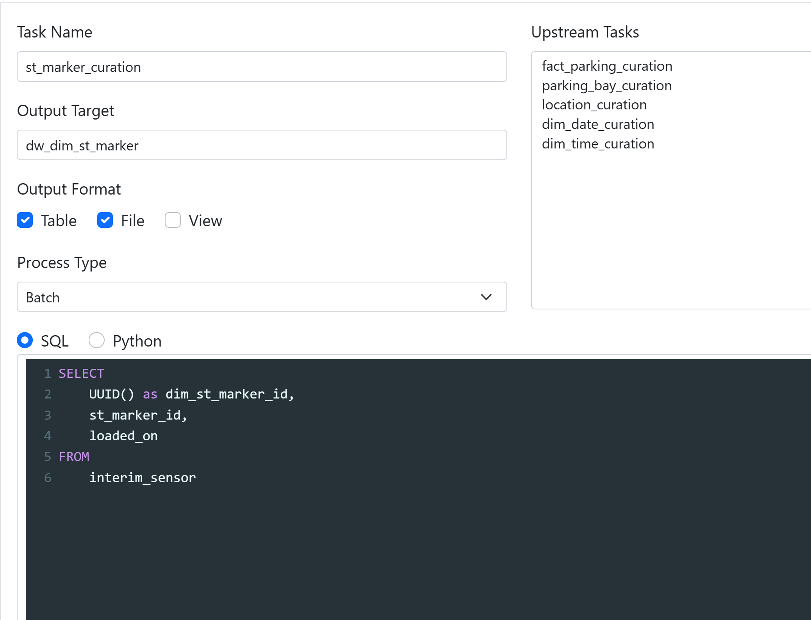

5# dim_date_curation, where we can use SQL query below to select all columns from stg_dim_date, which is the output target in the date_ingestion task in the staging stage, and save the output to dw_dim_date.
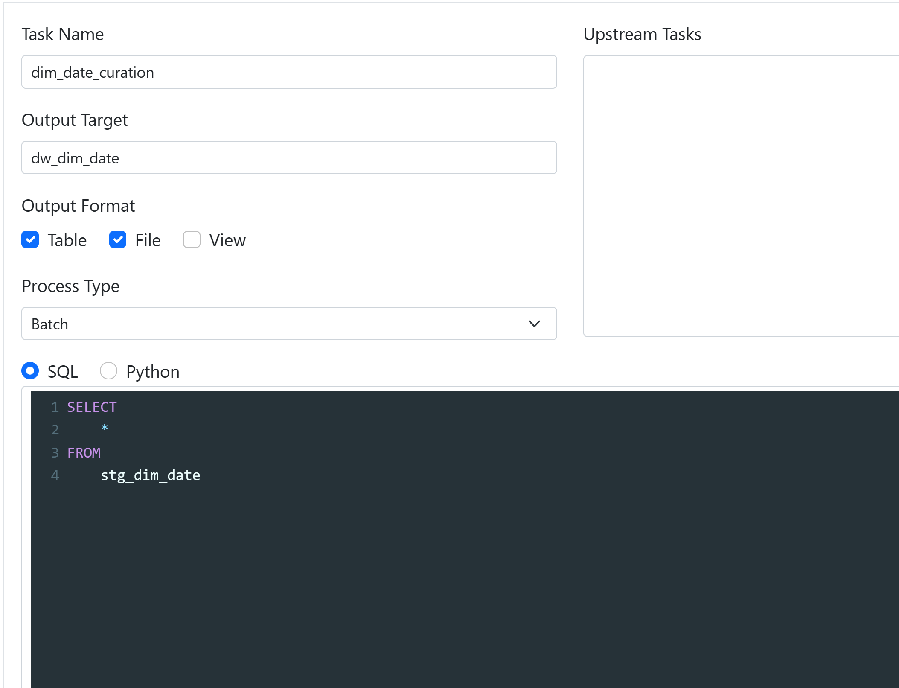

6# dim_date_curation, where we can use SQL query below to select all columns from stg_dim_time, which is the output target in the time_ingestion task in the staging stage, and save the output to dw_dim_time.
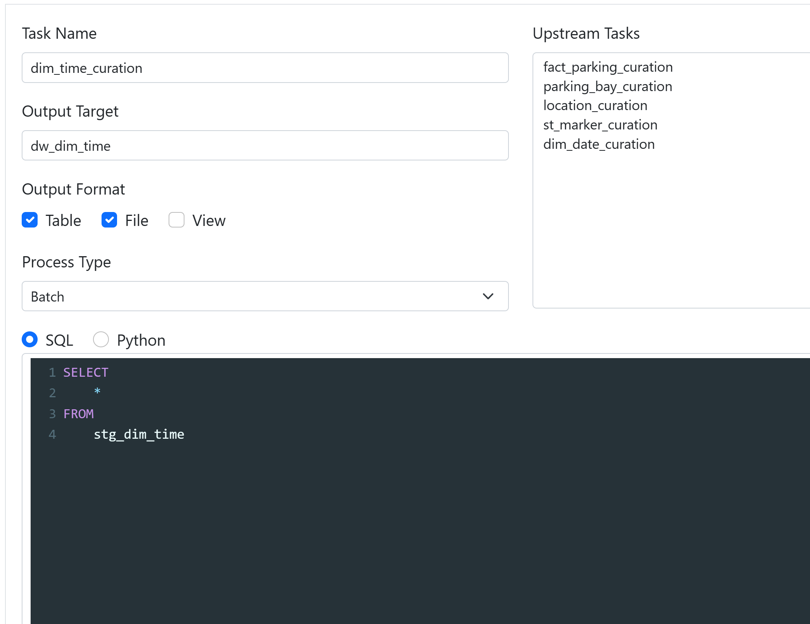

## 8. Click Code Editor
Click **Code Editor**, it is pipeline.json file which we will deploy to Databricks.
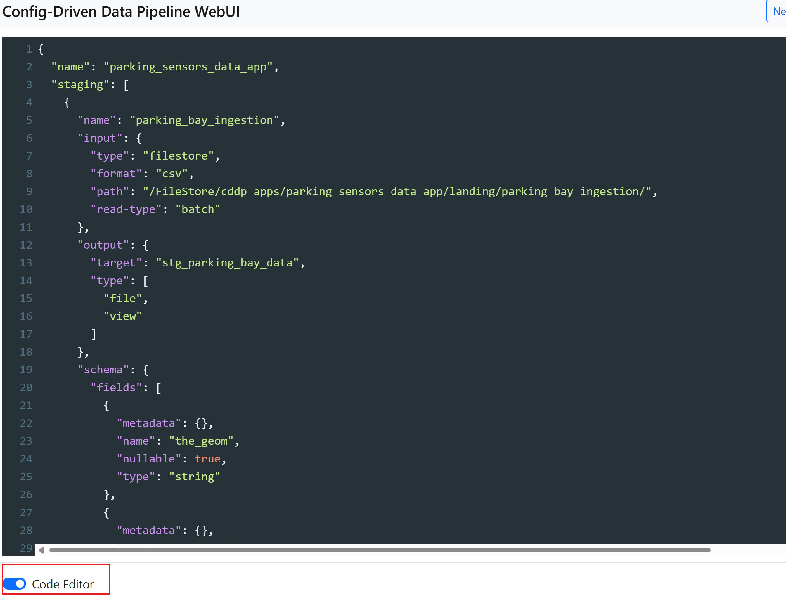
pipeline.json includes all the information that you defined in the previous section, covering pipeline stages, data source information, transformation and aggregation logic.

## 9. Deploy / Deploy & Run
Click **Deploy** or **Deploy & Run** to deploy all the data files and tasks into the specific databricks instance, and run the tasks.

If it has been deployed successfully, the web page will pop a new window that shows the successful message.
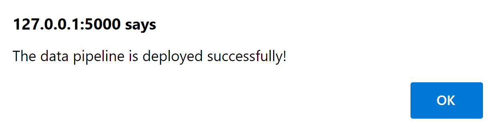
If you click **Deploy**, you will need to go to Databricks and click **Run Now** for the job in the workflow pane to trigger the job manually.
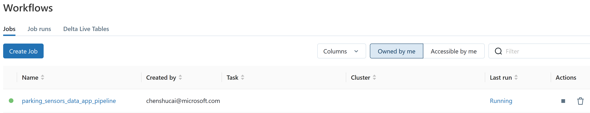
Will create a schema with all tables generated in the standardazation stage and serving stage.
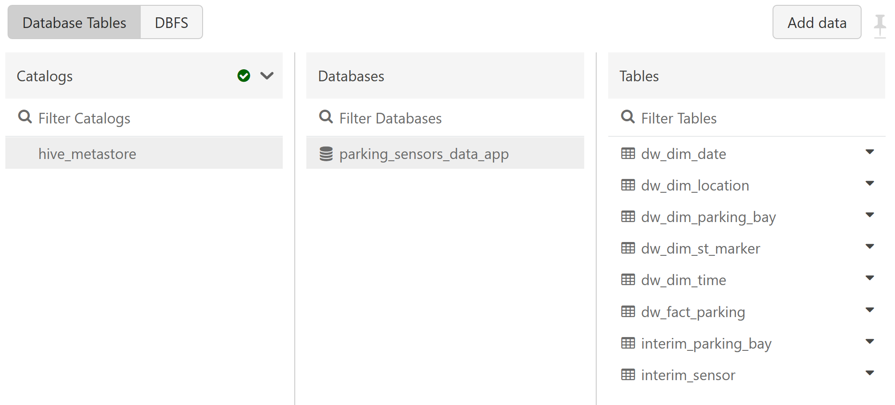

