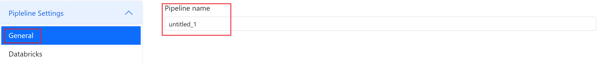
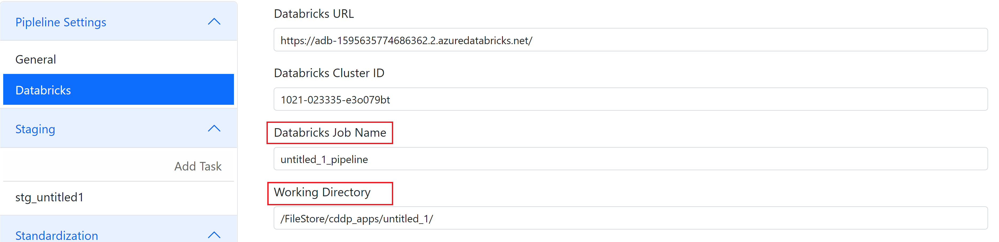
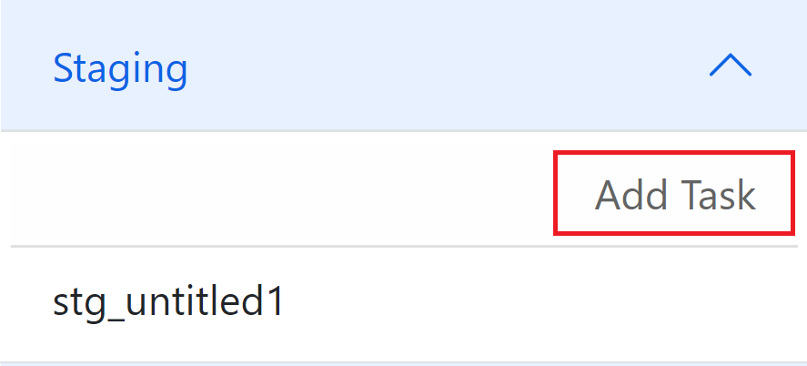
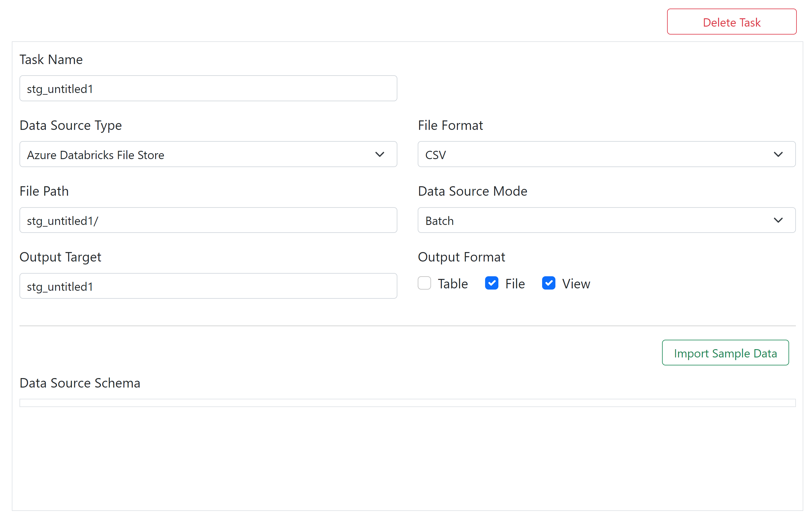
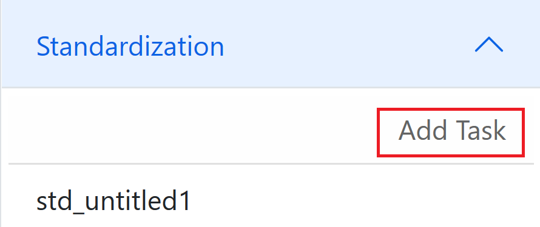
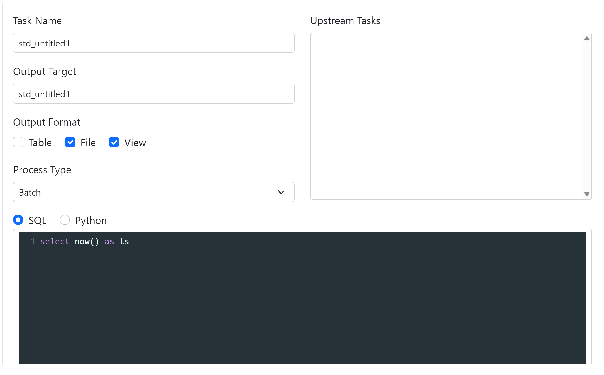
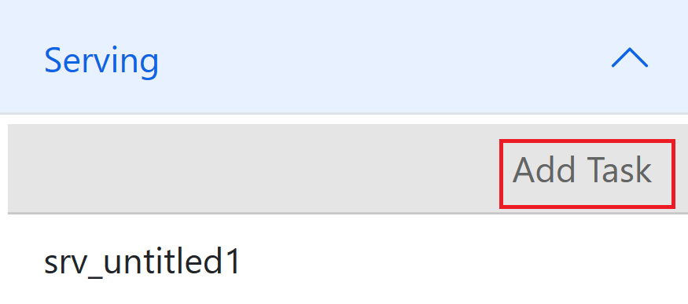
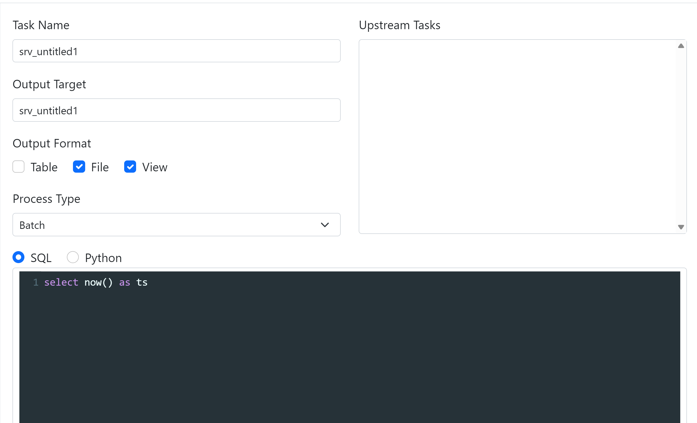
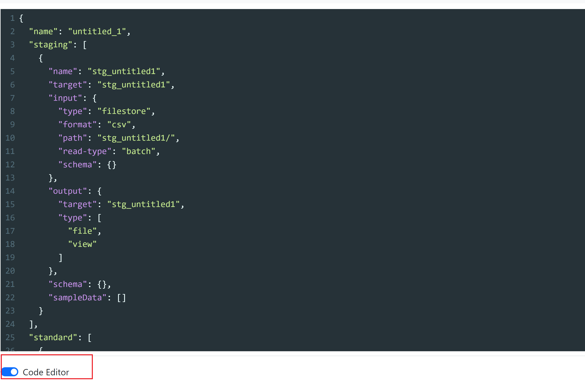
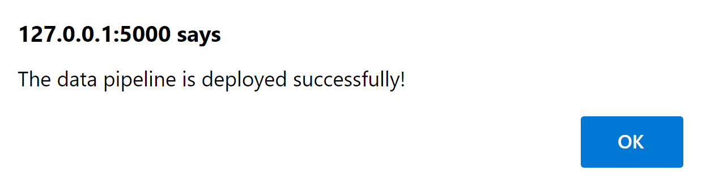

# How to Create New Pipeline
## 1. Create .env file to save information about Databricks settings
Get information about DATABRICKS_HOST, DATABRICKS_TOKEN, and DATABRICKS_CLUSTER, and create .env file to store them in order to specify the Databricks instance.
```sh
DATABRICKS_HOST=
DATABRICKS_TOKEN=
DATABRICKS_CLUSTER=
```
## 2. Run python web app using Flask
Run and Debug using Python: Flask.
## 3. Open the website
Open the website and click **New**.
## 4. Pipeline settings
Go to **Pipeline Settings**, click **General** to define Pipeline name.

Click **Databricks** to customize Databricks job name and working directory.

## 5. Staging stage
Go to **Staging** section, and click **Add Task** to create tasks, so that data from external systems can be ingested and stored in the staging stage. 

You can define several parameters.

Task Name : Name of task

Data Source Type: Azure Databricks File Store/ADLS Gen2/Relation Database

File Format: CSV/JSON

File path: Path for storing files

Data Source Mode: Batch/Streaming

Output Target: Name of the output result

Output Format: Table/File/View


After importing sample data, you can have a look at data source schema and sample data.
## 6. Standardization stage
Go to **Standardization** section, and click **Add Task** to create tasks, so that data from the staging stage can be cleansed and transformed and then stored in the standard stage.



You can customize task name, output target, choose output format and process type.

For the code editor, you can choose either SQL or Python to define the transformation logic, which is to clean and transform the data from the staging stage.

## 7. Serving stage
Go to **Serving** section, and click **Add Task** to create tasks, so that data from the standard stage can be aggregated and then stored in the serving stage.

You can customize task name, output target, choose output format and process type.

For the code editor, you can choose either SQL or Python to define the aggregation logic, which is to aggregate the data from the standard stage.

## 8. Click Code Editor
Click **Code Editor**, it is pipeline.json file which we will deploy to Databricks.

pipeline.json includes all the information that you defined in the previous section, covering pipeline stages, data source information, transformation and aggregation logic.

## 9. Click Deploy / Deploy & Run
Click **Deploy** or **Deploy & Run** to deploy all the data files and tasks into the specific databricks instance, and run the tasks.

If it has been deployed successfully, the web page will pop a new window that shows the successful message.

If you click **Deploy**, you will need to go to Databricks and click **Run Now** for the job in the workflow pane to trigger the job manually.