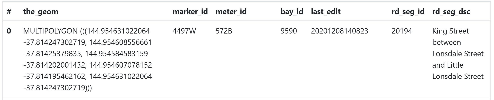
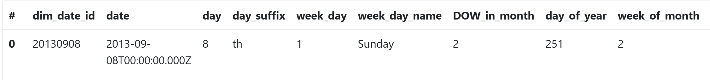
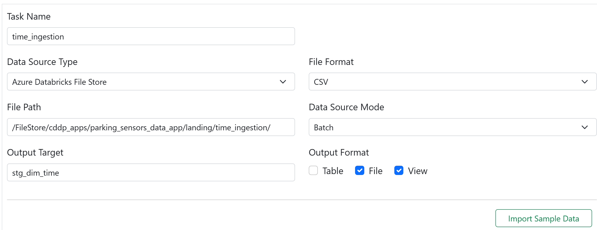
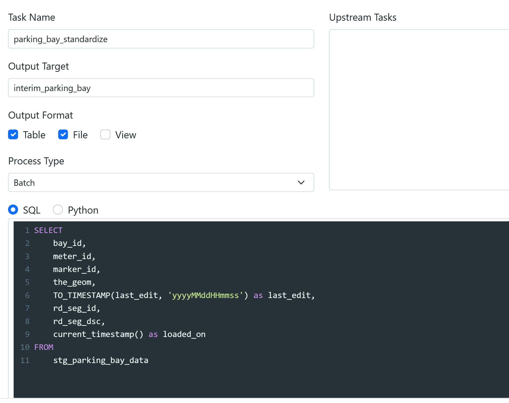
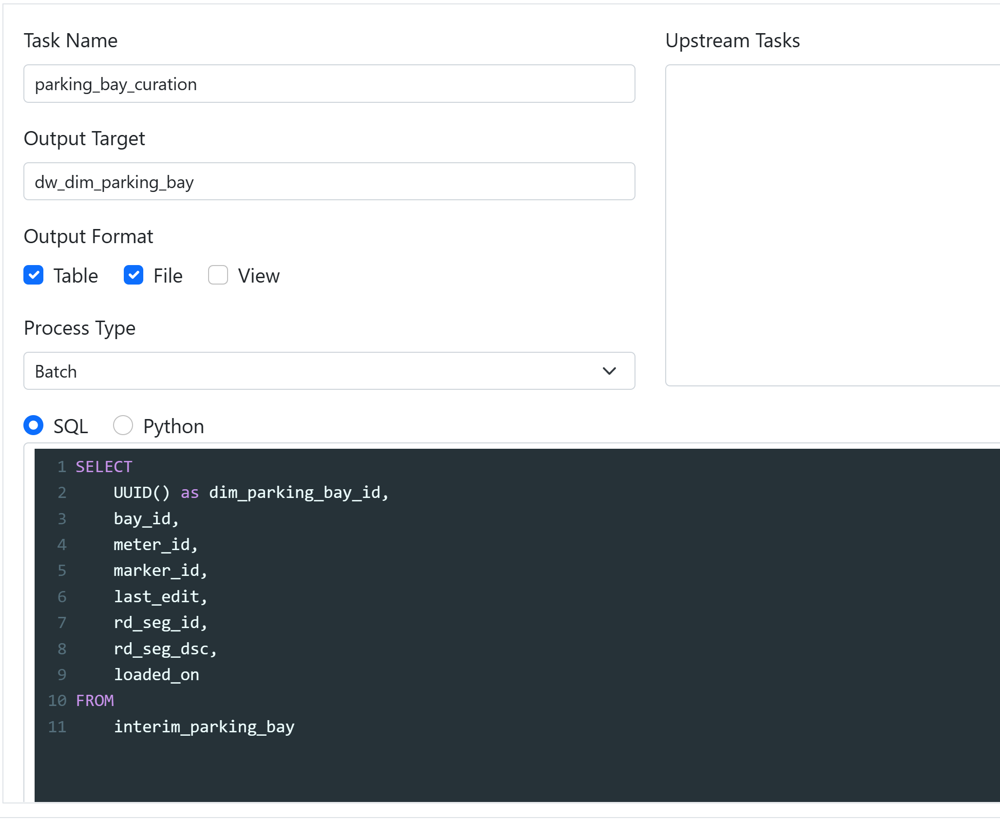
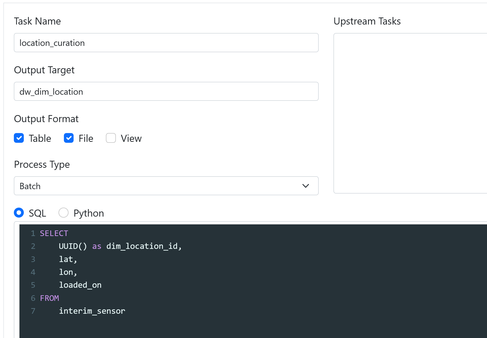
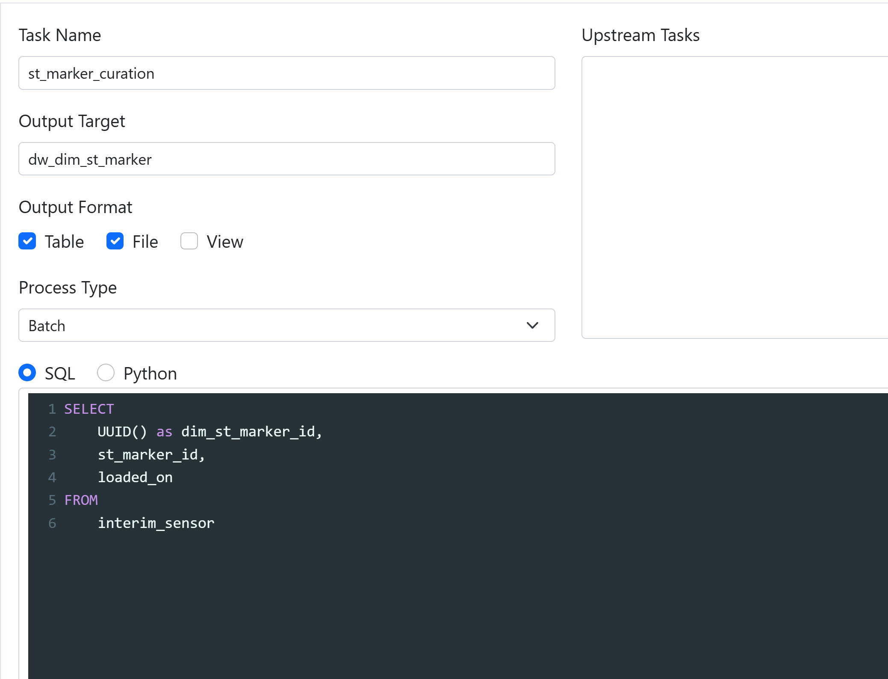

# How To Import/Create Parking Sensor Pipeline
- [1. Run Web App](#1-run-web-app)
    - [1.1 Create .env file](#11-create-env-file)
    - [1.2 Run python web app using Flask](#12-run-python-web-app-using-flask)
    - [1.3 Open the website](#13-open-the-website)
- [2. Import Parking Sensor Pipeline](#2-import-parking-sensor-pipeline)
    - [2.1 Import a pipeline](#21-import-json-file)
    - [2.2 Check the web app](#22-check-the-web-app)
- [3. Create New Parking Sensor Pipeline](#3-create-new-parking-sensor-pipeline)   
    - [3.1 Pipeline settings](#31-pipeline-settings)   
    - [3.2 Staging stage](#32-staging-stage) 
        - [3.2.1 parking_bay_ingestion](#321-parking_bay_ingestion)
        - [3.2.2 parking_sensors_ingestion](#322-parking_sensors_ingestion)
        - [3.2.3 date_ingestion](#323-date_ingestion)
        - [3.2.4 time_ingestion](#324-time_ingestion)
    - [3.3 Standardization stage](#33-standardization-stage)
        - [3.3.1 parking_bay_standardize](#331-parking_bay_standardize)
        - [3.3.2 parking_sensors_standardize](#332-parking_sensors_standardize)  
    - [3.4 Serving stage](#34-serving-stage)
        - [3.4.1 fact_parking_curation](#341-fact_parking_curation)
        - [3.4.2 parking_bay_curation](#342-parking_bay_curation)
        - [3.4.3 location_curation](#343-location_curation)
        - [3.4.4 st_marker_curation](#344-st_marker_curation)
        - [3.4.5 dim_date_curation](#345-dim_date_curation)
        - [3.4.6 dim_time_curation](#346-dim_time_curation)
    - [3.5 Code editor](#35-code-editor)  
- [4. Deploy / Deploy & Run](#4-deploy--deploy--run)
- [5. Import Sample Dashboard](#5-import-sample-dashboard)
## 1. Run Web App
### 1.1 Create .env file
Get information about DATABRICKS_HOST, DATABRICKS_TOKEN, and DATABRICKS_CLUSTER, and create .env file to store them in order to specify the Databricks instance.
```sh
DATABRICKS_HOST=
DATABRICKS_TOKEN=
DATABRICKS_CLUSTER=
```
### 1.2 Run python web app using Flask
Run and Debug using Python: Flask.
### 1.3 Open the website
Open the website, click **Import** to import a pipeline; otherwise, click **New** to create a new pipeline.

## 2. Import Parking Sensor Pipeline
### 2.1 Import a pipeline
Click **Import** in the homepage and upload [pipeline_parking_sensors.json](/example/pipeline_parking_sensors.json) file to import a pipeline.
### 2.2. Check the web app
Go to Staging stage to check data schema for sample data, and display a view for sample data ingested as well.

Go to Standardization/Serving stage to check the upstream tasks, output target and SQL queries which are used for data processing.


## 3. Create New Parking Sensor Pipeline
### 3.1 Pipeline settings
Click **New** in the homepage to create a new pipeline.

Go to **Pipeline Settings**, click **General** to define Pipeline name.

Click **Databricks** to customize Databricks job name and working directory.

### 3.2 Staging stage
Go to **Staging** section, and click **Add Task** to create tasks, so that data from external systems can be ingested and stored in the staging stage. 

We create four ingestion jobs, where we need to define task name, data source type, file format, file path, data source mode, output target, and output format.

After importing sample data, you can have a look at data source schema and sample data.

#### 3.2.1 parking_bay_ingestion
Ingest data about [parking bays](/example/data/parking-sensors/layer_0.csv) and save the output target as stg_parking_bay_data.
 

#### 3.2.2 parking_sensors_ingestion
Ingest data collected from [parking sensors](/example/data/parking-sensors/On-street_Parking_Bay_Sensors.csv) and save the output target as stg_parking_bay_data.
 

#### 3.2.3 date_ingestion
Ingest data about [date](/example/data/parking-sensors/seed/dim_date.csv) and save the output target as stg_dim_date.
 

#### 3.2.4 time_ingestion 
Ingest data about [time](/example/data/parking-sensors/seed/dim_time.csv) and save the output target as stg_dim_time.
 


### 3.3 Standardization stage
Go to **Standardization** section, and click **Add Task** to create tasks, so that data from the staging stage can be cleansed and transformed either using SQL or Python either SQL or Python and then stored in the standard stage.

We create two tasks in the standardization stage.

#### 3.3.1 parking_bay_standardize
We use SQL query below to select columns from stg_parking_bay_data, which is the output target of the [parking_bay_ingestion](#321-parking_bay_ingestion) task, convert data type for last_edit column, add a new column for current timestamp, and save the output to interim_parking_bay.
```sh
SELECT
    bay_id,
    meter_id,
    marker_id,
    the_geom,
    TO_TIMESTAMP(last_edit, 'yyyyMMddHHmmss') as last_edit,
    rd_seg_id,
    rd_seg_dsc,
    current_timestamp() as loaded_on
FROM
    stg_parking_bay_data
```


#### 3.3.2 parking_sensors_standardize
We use SQL query below to select columns from stg_parking_sensor_data, which is the output target of the [parking_sensors_ingestion](#322-parking_sensors_ingestion) task, convert data type for lat/lon column, add a new column for current timestamp, and save the output to interim_sensor.
```sh
SELECT
    bay_id,
    st_marker_id,
    status,
    location,
    FLOAT(lat) as lat,
    FLOAT(lon) as lon,
    current_timestamp() as loaded_on
FROM
    stg_parking_sensor_data
```


### 3.4 Serving stage
Go to **Serving** section, and click **Add Task** to create tasks, so that data from the standard stage can be aggregated using either SQL or Python and then stored in the serving stage.

We create six tasks in the serving stage.

#### 3.4.1 fact_parking_curation
Use SQL query below to select columns from interim_sensor, which is the output target in the previous [parking_sensors_standardize](#332-parking_sensors_standardize) task, convert data type for loaded_on column, add a new column for time id, and save the output to dw_fact_parking.
```sh
SELECT
    date_format(ps.loaded_on,'yyyyMMdd') as dim_date_id,
    unix_timestamp(ps.loaded_on)-unix_timestamp(DATE_TRUNC('DD',ps.loaded_on)) as dim_time_id,
    ps.bay_id,
    ps.st_marker_id,
    ps.status,
    ps.location,
    ps.lat,
    ps.lon,
    ps.loaded_on
FROM
    interim_sensor ps
```

#### 3.4.2 parking_bay_curation
Use SQL query below to select columns from interim_parking_bay, which is the output target of the previous [parking_bay_standardize](#331-parking_bay_standardize) task, add a new column for parking bay id using UUID, and save the output to dw_dim_parking_bay.
```sh
SELECT
    UUID() as dim_parking_bay_id,
    bay_id,
    meter_id,
    marker_id,
    last_edit,
    rd_seg_id,
    rd_seg_dsc,
    loaded_on
FROM
    interim_parking_bay
```

#### 3.4.3 location_curation
Use SQL query below to select columns from interim_sensor, which is the output target of the previous [parking_sensors_standardize](#332-parking_sensors_standardize) task, add a new column for location id using UUID, and save the output to dw_dim_location.
```sh
SELECT
    UUID() as dim_location_id,
    lat,
    lon,
    loaded_on
FROM
    interim_sensor
```

#### 3.4.4 st_marker_curation
Use SQL query below to select columns from interim_sensor, which is the output target of the previous [parking_sensors_standardize](#332-parking_sensors_standardize) task, add a new column for st marker id using UUID, and save the output to dw_dim_st_marker.
```sh
SELECT
    UUID() as dim_st_marker_id,
    st_marker_id,
    loaded_on
FROM
    interim_sensor
```

#### 3.4.5 dim_date_curation
Use SQL query below to select all columns from stg_dim_date, which is the output target of the [date_ingestion](#323-date_ingestion) task in the staging stage, and save the output to dw_dim_date.
```sh
SELECT
    *
FROM
    stg_dim_date
```

#### 3.4.6 dim_time_curation
Use SQL query below to select all columns from stg_dim_time, which is the output target of the [time_ingestion](#324-time_ingestion) task in the staging stage, and save the output to dw_dim_time.
```sh
SELECT
    *
FROM
    stg_dim_time
```


### 3.5 Code editor
Click **Code Editor**, it is pipeline.json file which we will deploy to Databricks.

pipeline.json includes all the information that you defined in the previous section, covering pipeline stages, data source information, transformation and aggregation logic.

## 4. Deploy / Deploy & Run
Click **Deploy** or **Deploy & Run** to deploy all the data files and tasks into the specific databricks instance, and run the tasks.

If it has been deployed successfully, the web page will pop a new window that shows the successful message.

If you click **Deploy**, you will need to go to Databricks and click **Run Now** for the job in the workflow pane to trigger the job manually.

You can check the job status for each task in the Workflow pane.

Will create a schema with all tables generated in the standardazation stage and serving stage if job runs successfully.


## 5. Import Sample Dashboard
Import [sample dashboard](/example/sample_dashboard.ipynb)  to Databricks Workspace, so that you can see some visualizaions about the curated results.

For example, the total parking spots availability and parking spots map.

