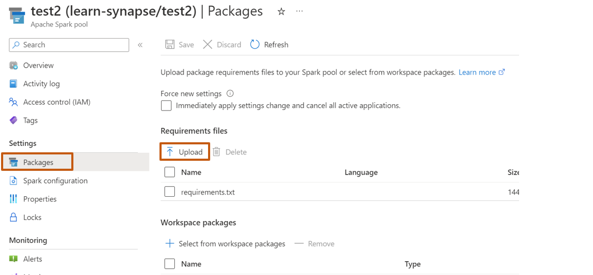
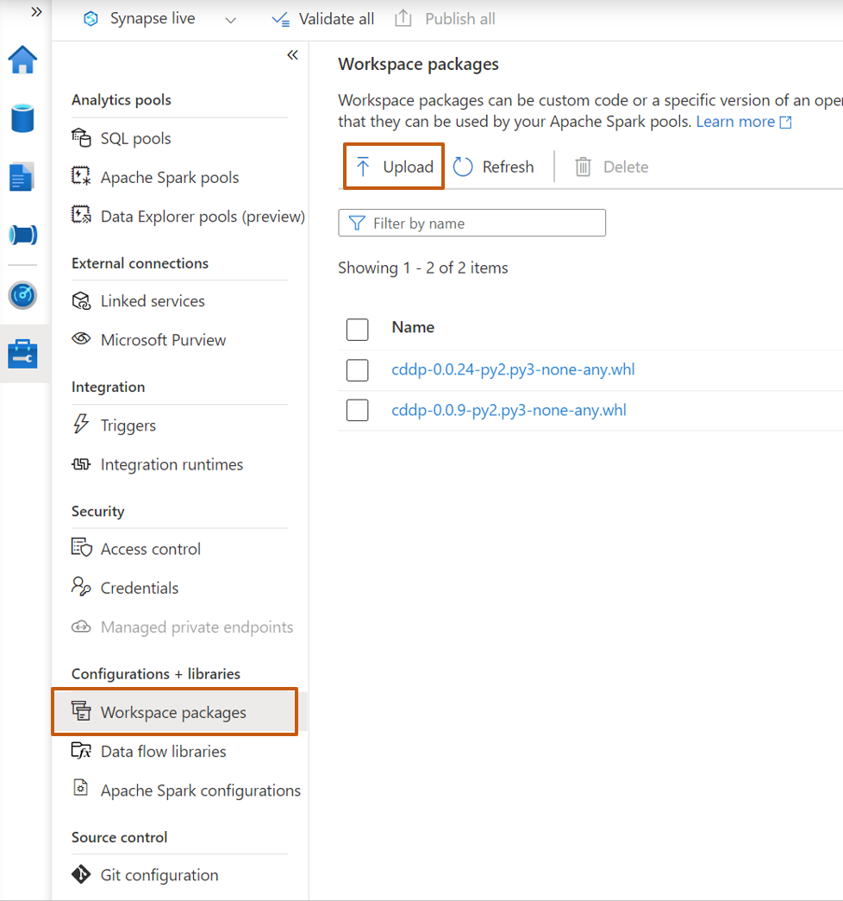
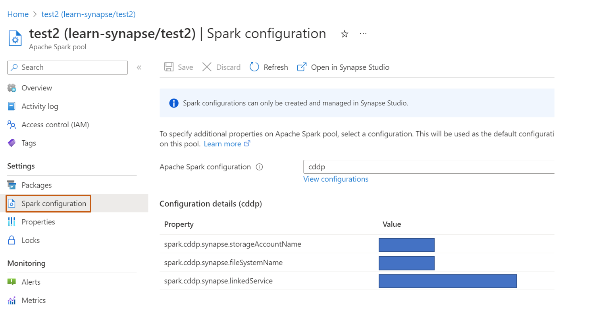
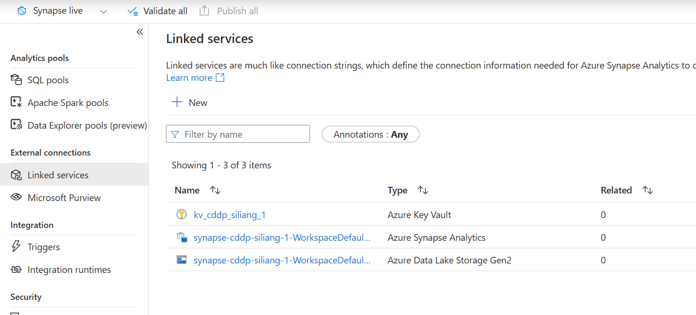
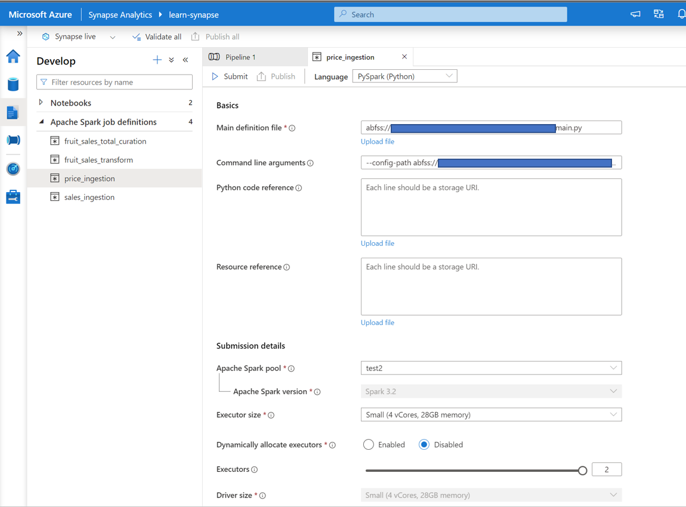
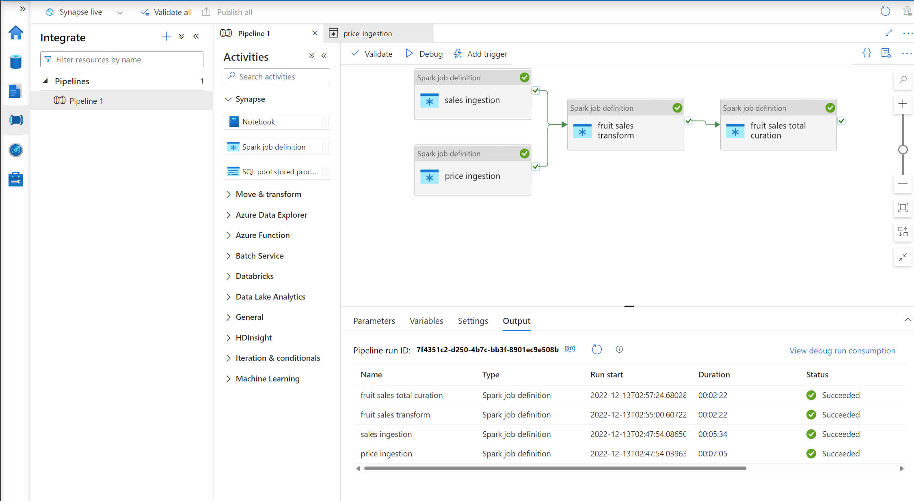

# Azure Synapse Analytics Integration
## Overview 

It is possible to create and deploy the CDDP pipeline to Azure Synapse Analytics and run the pipeline with Spark Pools. 
  
> "Azure Synapse Analytics is a limitless analytics service that brings together data integration, enterprise data warehousing, and big data analytics. It gives you the freedom to query data on your terms, using either serverless or dedicated options—at scale. "  

Some Features of Azure Synapse Analytics including:
- Perform data ingestion, exploration, analytics in one unified environment
- Deeply integrated Apache Spark and SQL engines
- Support multiple languages, including T-SQL, KQL, Python, Scala, Spark SQL, and .Net
- Built-in ability to explore data lake
- ...

Find more information about Azure Synapse Analytics from [here](https://azure.microsoft.com/en-us/products/synapse-analytics/#overview).


## Prerequisite

1. Create a Synapse workspace from Azure portal.
2. Go to the resouce page of workspace, create a new Apache Spark Pool.
3. Go to the resouce page of the Spark pool, under **packages**, install cddp package by uploading a *requirements.txt* which includes package name `cddp`.

4. If you would like to test a specific version of cddp or with a local built wheel,  
    - Open Synapse Studio from workspace
    - Upload the wheel file to workspace
    
    - Go back to pool page and add the package to pool by **Select from workspace packages**
5. Go back to the resouce page of the Spark pool, and add following Spark configurations.

    ```
    {
        "spark.cddp.synapse.storageAccountName": "[storage account name]",
        "spark.cddp.synapse.fileSystemName": "[file system name]",
        "spark.cddp.synapse.linkedService": "[linked service name]"
    }
    ```
    The settings above are used to specify the storage account and file system where the pipeline configuration file and data are stored.  

    Each Synapse workspace are created with a default storage account and file system. You can either use this default storage account and file system or create a new one and link it to the workspace.   
6. Link an Azure Key Vault to the workspace to manage secrets.  
Pipelines may need to retrieve secrets such as connection strings, certificates, and passwords to access data sources.   
Synapse manages secrets through Azure Key Vaults that are linked to the workspace.   
You can use the linked Key Vault to store secrets and then reference them in the pipeline configuration file.  
    



## Create a Spark Job Definition Manually

1. Upload the main definition file to the linked storage account (you can use the **src/main.py** under this repo as the main definition file).
    ```
    import cddp
    import cddp.dbxapi as dbxapi

    # disable informational messages from prophet
    import logging
    logging.getLogger('py4j').setLevel(logging.ERROR)

    if __name__ == "__main__":
        cddp.entrypoint()
    ```
2. Upload sample data and pipeline configuation file to the linked storage account (**/example/\*\***).

3. Modify pipeline configurations. Pipeline configurations are stored in a json file. Settings for Synapse are similar to those for Databricks.
    ```json
    "secret_scope": "<key vault linked service name>",
    "storage-account_access_key": "<secret name of the access key in the kv>",
    "storage_account": "<storage account name>",
    "container_name": "<file system name (container name)>",
    "data_folder": "<path of the source data file>"
    ```
    To specify the sources for datasets, you may need to provide connection strings, certificates, and secrets. Synapse manages secrets through Azure Key Vaults that are linked to the workspace. You can use the linked Key Vault to store secrets and then reference them in the pipeline configuration file.  

    For example, suppose you want to ingest data saved in a storage account `sacddp1` under container `cddpfs` with path `example/data/fruit-price/001.csv`.   
    Firstly, add the access key of the storage account in Azure Key Vault which linked to Synpase. Assumes the linked service name of the key vault is `kv-cddp-1` and the secret name for the access key is `fruitsaaccesskey`.  

    Then modify the configurations like following,
    ```json
    "secret_scope": "kv-cddp-1",
    "storage-account_access_key": "fruitsaaccesskey",
    "storage_account": "sacddp1",
    "container_name": "cddpfs",
    "data_folder": "example/data/fruit-price/001.csv",
    ```

    With these configurations, the pipeline will read the data from the storage account `sacddp1` under container `cddpfs` with path `example/data/fruit-price/001.csv`.


4. Open Synapse Studio, go to **develop**, and add a new Spark Job Definition.
5. Fill in the main definiation file path and command line arguments with the `abfss://` path of the main.py you uploaded in **step 1**.  
**Note** please check if **Language** is set to `PySpark(Python)`

    - main definition file path:
        ```
        "abfss://[file system name]@[storage account name].dfs.core.windows.net/main.py"
        ```
    - command line arguments:   
        To run all tasks in the pipeline:
        ```
        "--config-path abfss://[file system name]@[storage account name].dfs.core.windows.net/example/pipeline_fruit_batch_ADLS.json 
        ```
        To run a specific task in the pipeline:
        ```
        "--config-path abfss://[file system name]@[storage account name].dfs.core.windows.net/example/pipeline_fruit_batch_ADLS.json --stage staging --task price_ingestion --working-dir ./tmp --show-result --build-landing-zone --cleanup-database"
        ```
    > **Tips:** Quickly find the `abfss://` path of your file using **data** tab in the Synapse Studio. Go to **data** --> **linked** --> **your storage account** --> find your file --> click **More** of top bar --> **Properties** --> copy the `abfss://` path.
6. Submit the job definition to start a run.
7. Publish the job.  
8. You can also Create a pipeline to run multiple jobs.


