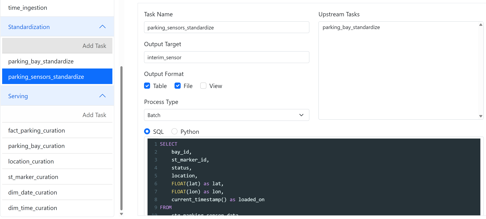
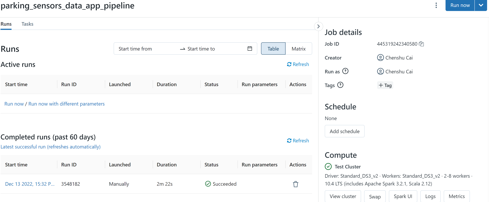

# Parking Sensors Demo
## 1. Create .env file to save information about Databricks settings
Get information about DATABRICKS_HOST, DATABRICKS_TOKEN, and DATABRICKS_CLUSTER, and create .env file to store them in order to specify the Databricks instance.
```sh
DATABRICKS_HOST=
DATABRICKS_TOKEN=
DATABRICKS_CLUSTER=
```
## 2. Run python web app using Flask
Run and Debug using Python: Flask
## 3. Open the website and create new pipeline by importing the specific json file
Click "Import" and upload pipeline_parking_sensors.json file.

## 4. Check web app
Go to Staging zone to get data schema for sample data, and display a view for sample data ingested as well.

Go to Standardization/Serving zone to check the upstream tasks, output target and SQL queries which are used for data processing.


## 5. Click "Deploy" or "Deploy & Run"
If no error occurs, select "Deploy" or "Deploy & Run" to deploy all the data files and tasks into the specific databricks instance, and run the tasks.
If it has been deployed successfully, the web page will pop a new window that shows the successful message.

If you click "Deploy", you will need to go to Databricks and click "Run Now" for "parking_sensors_data_app_pipeline" job in the workflow pane to trigger the job manually.

## 6. Import sample dashboard to Workspace
Import [sample dashboard](sample_dashboard.ipynb)  to workspace, so that you can see some visualizaions about the curated results.

For example, the total parking spots availability and parking spots map.

